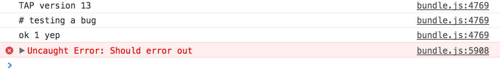

# test-electron-source-maps

[](http://github.com/badges/stability-badges)

Testing a bug with source maps

Steps to reproduce:

```sh
# clone the repo
git clone https://github.com/mattdesl/test-electron-source-maps.git

# cd into it
cd test-electron-source-maps

# install dependencies
npm install
```

To test the script in Electron: (view console)

```sh
npm run electron
```

To test the script in a regular browser: (view console then reload the page)

```sh
npm run browser
```

Electron shows `bundle.js` -- whereas Chrome source maps it correctly and shows `test.js` (after initial page refresh).



## License

MIT, see [LICENSE.md](http://github.com/mattdesl/test-electron-source-maps/blob/master/LICENSE.md) for details.
